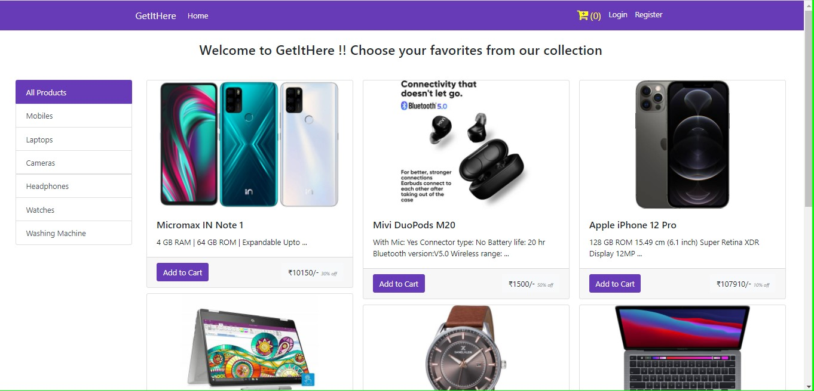
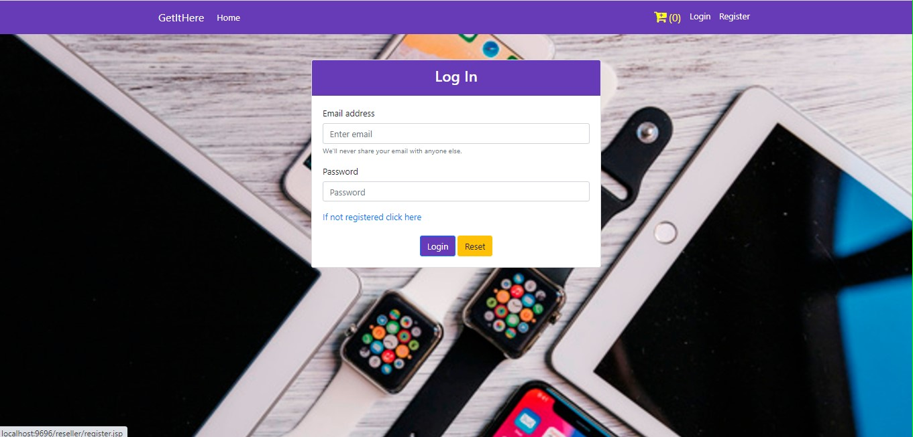
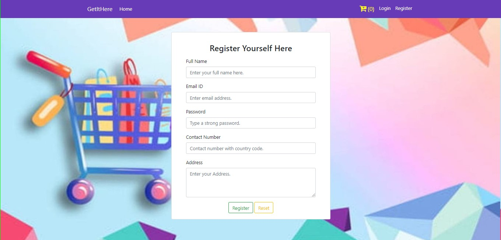
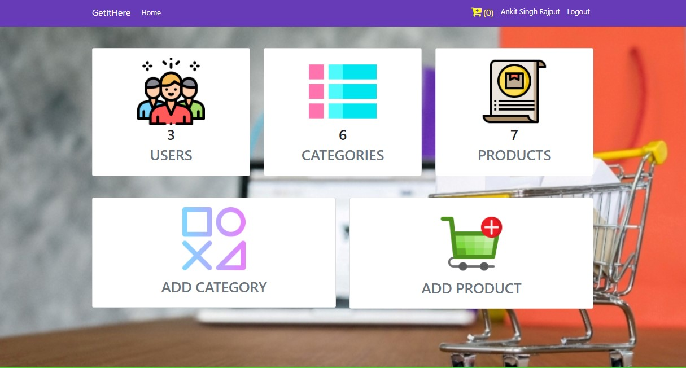

# GetItHere Ecommerce Website

> Welcome to GetItHere ! Choose your favorites from our collection dear !!

---

### Table of Contents

- [Description](#description)
- [References](#references)
- [Outputs](#outputs)
- [License](#license)
- [Author Info](#author-info)

---

## Description

This is an e-commerce website aimed to provide the direct interface between the seller and the consumer. Using this webapp, the seller can directly upload their products without the interference of any broker or middle-men, which will result in the upliftment of the profit and upraised teh sells of the seller. 
Now talking about the benefits for consumer includes easy search of desired product, separate profiles for each consumer with their respective login details saved in the database. This will result in faster login access and hence will provide smooth experience. 
Also, I have tried to maintain a good visual experience by using some of the front-end technologies. GetItHere provides separate user interfaces for the seller and the consumer.

#### Languages and Technologies

- Backend:
  - Java
  - Java Servlets
- Frontend:
   - HTML
   - CSS
   - JavaScript
- DataBase:
  - MySQL

[Back To The Top](#getithere-ecommerce-website)

---

## References

UI of the ecommerce website [Flipkart](flipkart.com) for the frontend and some online resources for images.

[Back To The Top](#getithere-ecommerce-website)

---

## Outputs

[Back To The Top](#getithere-ecommerce-website)

---
## License

**MIT License**

Copyright (c) 2021 Ankit Singh Rajput

Permission is hereby granted, free of charge, to any person obtaining a copy
of this software and associated documentation files (the "Software"), to deal
in the Software without restriction, including without limitation the rights
to use, copy, modify, merge, publish, distribute, sublicense, and/or sell
copies of the Software, and to permit persons to whom the Software is
furnished to do so, subject to the following conditions:

The above copyright notice and this permission notice shall be included in all
copies or substantial portions of the Software.

THE SOFTWARE IS PROVIDED "AS IS", WITHOUT WARRANTY OF ANY KIND, EXPRESS OR
IMPLIED, INCLUDING BUT NOT LIMITED TO THE WARRANTIES OF MERCHANTABILITY,
FITNESS FOR A PARTICULAR PURPOSE AND NONINFRINGEMENT. IN NO EVENT SHALL THE
AUTHORS OR COPYRIGHT HOLDERS BE LIABLE FOR ANY CLAIM, DAMAGES OR OTHER
LIABILITY, WHETHER IN AN ACTION OF CONTRACT, TORT OR OTHERWISE, ARISING FROM,
OUT OF OR IN CONNECTION WITH THE SOFTWARE OR THE USE OR OTHER DEALINGS IN THE
SOFTWARE.

[Back To The Top](#getithere-ecommerce-website)

---

## Author Info

- Twitter - [@Ankit Singh Rajput](https://twitter.com/_ankit_sr)
- Website - [Portfolio](https://anit-sr.github.com)

[Back To The Top](#getithere-ecommerce-website)

